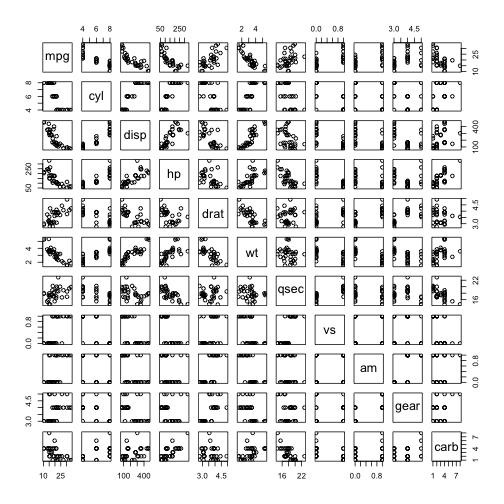

This is a Shiny application on MT cars fuel consumption (Developing Data Products Course Project)
========================================================
author: Lim Chong Hoong
date: 22 November 2015

Presentation Objective
========================================================
The objective is to present a Shiny application that was created for the course project - Developing Data Products.

Design
========================================================
The application uses the default "mtcars" dataset installed with R. It contains plot settings for interactive data analysis without much code modifications.

The application can be accessed at the following URL:
https://chonghoong.shinyapps.io/09_Developing_Data_Products

The data is from the 1974 Motor Trend US magazine and comprises fuel consumption and ten characteristics of automobile design and performance for 32 cars (1973-74 models).

Plotting
========================================================

To plot in R, just simply run plot(mtcars)
 

Summary - Page 5
========================================================

This Shiny application displays the fuel consumption based on the transmission type, cylinders and horse power variables.
